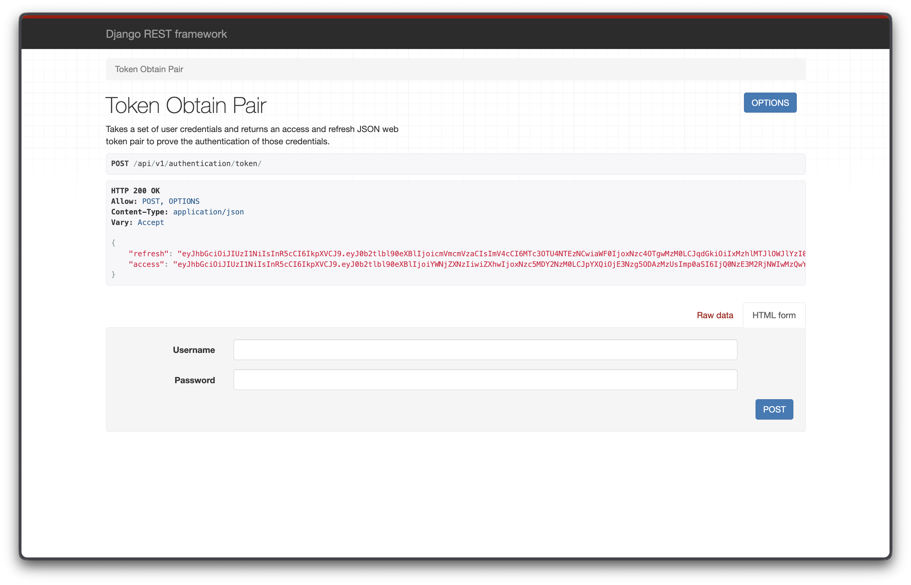
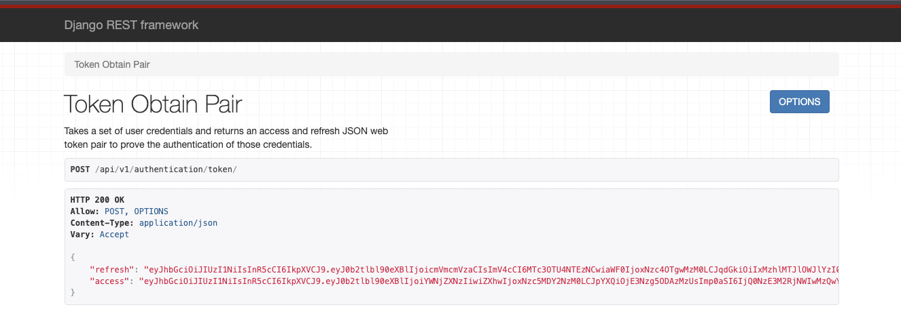

# Flix API

API REST para gerenciamento de filmes, atores, gêneros e avaliações cinematográficas, construída com Django e Django REST Framework. Esta API é o backend do dashboard **Flix App** ([github.com/marcosilvaa/flix_app](https://github.com/marcosilvaa/flix_app)).

## Tecnologias

- Python 3.13+
- Django 5.2.7
- Django REST Framework 3.16.1
- SimpleJWT 5.5.1 (autenticação JWT)
- SQLite (banco de dados padrão)
- uv (gerenciador de pacotes)

## Início Rápido

```bash
# Instalar dependências
uv sync

# Executar migrações
python manage.py migrate

# Criar superusuário (necessário para obter token JWT)
python manage.py createsuperuser

# Iniciar servidor de desenvolvimento
python manage.py runserver
```

> **Nota:** `DEBUG = True` em `app/settings.py` para desenvolvimento. Em produção, altere para `False` e configure `ALLOWED_HOSTS`.

## Comandos Úteis

```bash
# Rodar todos os testes
python manage.py test

# Rodar testes de um app específico
python manage.py test genres

# Lint
python -m flake8 .

# Criar/aplicar migrações
python manage.py makemigrations
python manage.py migrate

# Importar atores via CSV
python manage.py import_actors actors.csv

# Coletar arquivos estáticos (produção)
python manage.py collectstatic --noinput
```

## Como a API Funciona

### Visão Geral

A Flix API segue uma arquitetura RESTful onde cada recurso (gêneros, atores, filmes, avaliações) é exposto como um endpoint independente. O fluxo de dados é:

```
Flix App (Dashboard)  →  Flix API (Backend)  →  SQLite (Banco de Dados)
                              ↑
                        Autenticação JWT
```

1. O **dashboard** (Flix App) faz login enviando `username` e `password` para obter um token JWT.
2. Todas as requisições subsequentes incluem o token no header `Authorization: Bearer <access_token>`.
3. A API verifica o token e as permissões do usuário antes de processar cada requisição.
4. Os dados são persistidos no SQLite e retornados como JSON.

### Fluxo de Autenticação

Toda a API é protegida por autenticação JWT. Sem um token válido, qualquer requisição retorna `401 Unauthorized`. O fluxo funciona assim:

```
┌─────────────────────────────────────────────────────────┐
│  1. POST /api/v1/authentication/token/                  │
│     Body: { "username": "admin", "password": "***" }    │
│     → Retorna { "access": "...", "refresh": "..." }     │
├─────────────────────────────────────────────────────────┤
│  2. GET/POST/PUT/DELETE /api/v1/<recurso>/              │
│     Header: Authorization: Bearer <access_token>         │
│     → Retorna dados do recurso                           │
├─────────────────────────────────────────────────────────┤
│  3. POST /api/v1/authentication/token/refresh/           │
│     Body: { "refresh": "..." }                           │
│     → Retorna { "access": "<novo_access_token>" }        │
└─────────────────────────────────────────────────────────┘
```

#### Passo 1 — Obter Token

Envie suas credenciais para obter o par de tokens:



A DRF fornece uma interface navegável no browser. No endpoint `/api/v1/authentication/token/`, envie um POST com `username` e `password` no corpo da requisição.

#### Passo 2 — Receber Tokens

A resposta retorna dois tokens:



- **access**: Token JWT válido por **1 dia**. Deve ser enviado no header `Authorization: Bearer <access>` em todas as requisições protegidas.
- **refresh**: Token JWT válido por **7 dias**. Usado para obter um novo `access` token quando o anterior expira, sem precisar enviar credenciais novamente.

#### Passo 3 — Usar o Token

Inclua o token de acesso no header de qualquer requisição:

```bash
curl -H "Authorization: Bearer <access_token>" http://localhost:8000/api/v1/movies/
```

#### Passo 4 — Renovar o Token

Quando o `access` token expirar (após 1 dia), use o `refresh` token para obter um novo:

```bash
curl -X POST http://localhost:8000/api/v1/authentication/token/refresh/ \
  -H "Content-Type: application/json" \
  -d '{"refresh": "<refresh_token>"}'
```

### Sistema de Permissões

Após autenticar, o usuário ainda precisa ter **permissões específicas** para cada ação. A API usa o sistema de permissões do Django mapeado automaticamente pelo método HTTP:

| Método HTTP | Permissão Necessária | Exemplo |
|-------------|---------------------|---------|
| GET | `view` | `movies.view_movie` |
| POST | `add` | `movies.add_movie` |
| PUT/PATCH | `change` | `movies.change_movie` |
| DELETE | `delete` | `movies.delete_movie` |

O **superusuário** criado com `createsuperuser` possui todas as permissões automaticamente. Para outros usuários, as permissões devem ser atribuídas via Django Admin ou programaticamente.

### Relacionamentos entre Recursos

Os recursos da API estão interligados no banco de dados:

```
Genre ←──(1:N)──→ Movie ←──(N:M)──→ Actor
                    │
                    └──(1:N)──→ Review
```

- **Gêneros** são independentes — podem ser criados sem depender de outros recursos.
- **Atores** são independentes — podem ser criados sem depender de outros recursos.
- **Filmes** dependem de um **Gênero** (FK obrigatório) e podem ter múltiplos **Atores** (M2M).
- **Avaliações** dependem de um **Filme** (FK obrigatório) e incluem nota (0-5 estrelas) e comentário.

Para criar um filme, primeiro é preciso ter pelo menos um gênero e, opcionalmente, atores cadastrados:

```json
// POST /api/v1/movies/
{
  "title": "Interestelar",
  "genre": 1,          // ID do gênero (obrigatório)
  "actors": [10, 17],  // IDs dos atores (opcional)
  "release_date": "2014-11-07",
  "resume": "Um grupo de astronautas..."
}
```

### Padrão de Serialização Dupla (Filmes)

O endpoint de filmes usa **serializers diferentes** para leitura e escrita:

- **GET** retorna objetos expandidos:

```json
{
  "id": 1,
  "title": "Interestelar",
  "genre": { "id": 4, "name": "Ficcao Cientifica" },
  "actors": [{ "id": 10, "name": "Leonardo DiCaprio", "birthdate": null, "nationality": null }],
  "release_date": "2014-11-07",
  "rate": 4.2,
  "resume": "Um grupo de astronautas..."
}
```

- **POST/PUT/PATCH** aceita apenas IDs:

```json
{
  "title": "Interestelar",
  "genre": 4,
  "actors": [10, 17],
  "release_date": "2014-11-07",
  "resume": "Um grupo de astronautas..."
}
```

O campo `rate` é calculado automaticamente a partir da média das avaliações (`stars`) do filme e aparece apenas em GET.

### Endpoint de Estatísticas

`GET /api/v1/movies/stats/` retorna um resumo consolidado:

```json
{
  "total_movies": 25,
  "movies_by_genre": [
    { "genre__name": "Acao", "count": 3 },
    { "genre__name": "Drama", "count": 5 },
    { "genre__name": "Crime", "count": 4 }
  ],
  "total_reviews": 59,
  "average_stars": 4.4
}
```

## Estrutura do Projeto

```
flix_api/
├── app/                # Configuração central do Django (settings, urls, permissions)
├── actors/             # Módulo de atores
├── genres/             # Módulo de gêneros
├── movies/             # Módulo de filmes
├── reviews/            # Módulo de avaliações
├── authentication/     # Endpoints JWT (token, refresh, verify)
├── docs/               # Documentação detalhada
├── images/             # Prints da API (autenticação e token)
├── manage.py           # Utilitário Django
├── pyproject.toml      # Dependências e configuração do projeto
├── requirements.txt    # Dependências exportadas (pip)
└── db.sqlite3          # Banco SQLite (versionado)
```

## Endpoints da API

Todos os endpoints estão sob o prefixo `/api/v1/`.Todos exigem autenticação JWT.

| Recurso | Listar/Criar | Detalhe/Atualizar/Remover |
|---------|-------------|--------------------------|
| Gêneros | `/api/v1/genres/` | `/api/v1/genres/{id}/` |
| Atores | `/api/v1/actors/` | `/api/v1/actors/{id}/` |
| Filmes | `/api/v1/movies/` | `/api/v1/movies/{id}` |
| Avaliações | `/api/v1/reviews/` | `/api/v1/reviews/{id}` |
| Estatísticas | — | `/api/v1/movies/stats/` |

Autenticação JWT:

| Ação | Endpoint |
|------|----------|
| Obter token | `POST /api/v1/authentication/token/` |
| Renovar token | `POST /api/v1/authentication/token/refresh/` |
| Verificar token | `POST /api/v1/authentication/token/verify/` |

## Documentação

| Documento | Descrição |
|-----------|-----------|
| [Estrutura do Projeto](docs/estrutura_do_projeto.md) | Organização de diretórios e responsabilidade de cada pasta e arquivo |
| [Modelos de Dados](docs/modelos_de_dados.md) | Modelos Django, campos, relacionamentos e restrições |
| [Endpoints da API](docs/endpoints_da_api.md) | Lista completa dos endpoints, métodos HTTP e exemplos de uso |
| [Sistema de Permissões](docs/sistema_de_permissoes.md) | Como funciona o controle de acesso e mapeamento de permissões |
| [Sistema de Autenticação](docs/sistema_de_autenticacao.md) | Fluxo JWT, configuração e uso dos tokens |
| [Padrões e Convenções](docs/padroes_e_convencoes.md) | Convenções de código, serialização, URLs e nomenclatura |
| [Guia de Desenvolvimento](docs/guia_de_desenvolvimento.md) | Setup, comandos, fluxo de trabalho e dicas para contribuição |
| [Problemas Conhecidos](docs/problemas_conhecidos.md) | Bugs, inconsistências e pontos de atenção no código |